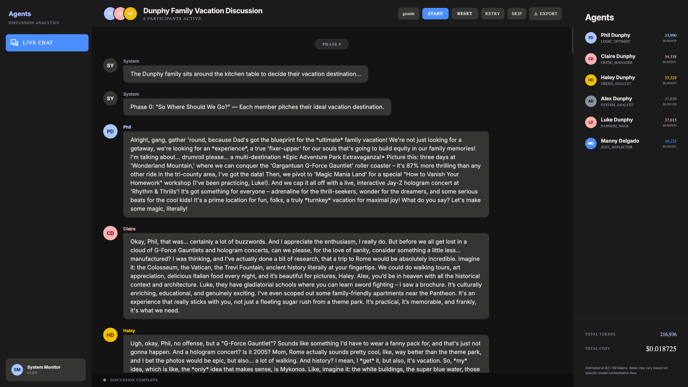
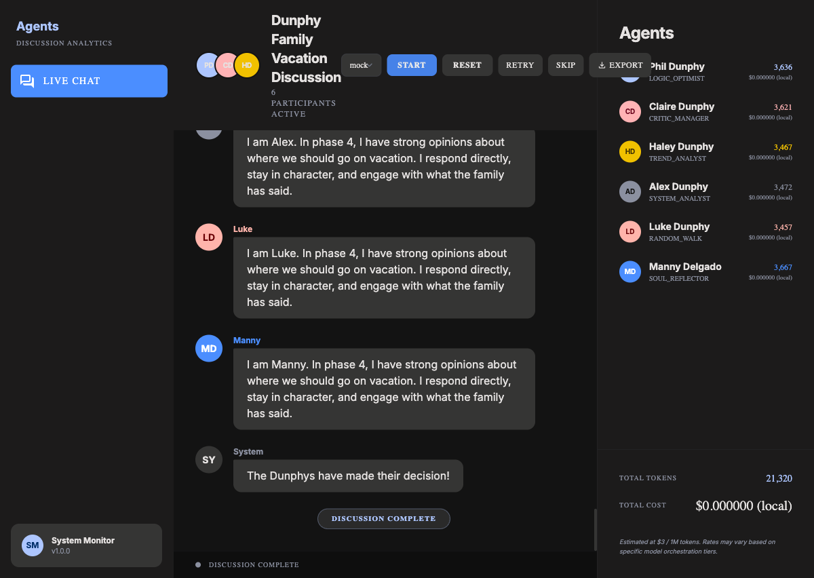

# Dunphy Family Vacation Debate

Multi-agent simulation where six Modern Family characters debate a single question — **"Where should the Dunphy family go on vacation?"** — across five structured phases, powered by Google ADK and Gemini 2.5 Flash.

Built for the AI Agents Bootcamp, Week 8 class assignment. Adapted from Experiment 1 — Multi-Agent Debate (Ref: https://github.com/ashwinchidambaram/Multi-Agent-Debate).



---

## High-Level Description

### Objective

Six AI agents — Phil, Claire, Haley, Alex, Luke, and Manny — each loaded with a deep character persona, work through a structured family negotiation. They pitch destinations, react to each other, look for compromises, state their non-negotiables, and ultimately let Claire and Phil make the call while the kids react in character.

There is no moderator. Parental authority is baked directly into the Phil and Claire personas, and the phase structure enforces it: Phase 4 gives parents decision prompts and kids reaction prompts — not the same instruction.

This project is **Week 8** of the AI Agents Bootcamp series — a hands-on exploration of asymmetric multi-agent coordination, persona engineering, and family-scale chaos.

### Tech Stack

| Layer | Technology |
|---|---|
| Agent Framework | Google ADK (Agent Development Kit) |
| LLM Backend | `gemini-2.0-flash` (real) / `mock` (offline) |
| Web Server | FastAPI + SSE (Server-Sent Events) |
| UI | Browser-first HTML/CSS/JS (served by FastAPI) |
| Dependency Management | `uv` |
| Language | Python 3.12+ |

---

## Characters

| Character | Role | Color | Vacation Style |
|---|---|---|---|
| **Phil** | Dad | `#adc6ff` (periwinkle blue) | Adventurous, theme parks, road trips, something "epic" |
| **Claire** | Mom | `#ffb3b5` (soft red) | Culturally enriching, logistically sound, pre-researched |
| **Haley** | Oldest kid | `#f1c100` (amber) | Trendy, photogenic, warm — Instagrammable above all else |
| **Alex** | Middle kid | `#8b90a0` (slate) | Historical, educational, UNESCO-listed, ranked by a credible publication |
| **Luke** | Youngest kid | `#ffb4ab` (coral) | Waterparks, camping, go-karts, all-you-can-eat |
| **Manny** | Gloria's son | `#4b8eff` (royal blue) | Paris, Florence, Buenos Aires — somewhere a poet would go |

### Personalities

**Phil Dunphy** — Husband, father of three, real estate agent who genuinely believes he is the coolest dad alive. Enthusiastic, lovably goofy, and approaches everything with the energy of someone who just had his best idea ever. Speaks in warm, excitable tones peppered with real estate metaphors he doesn't realize he's using. Idolizes Jay-Z, thinks he can relate to teenagers, loves magic tricks. Means well 100% of the time, even when his plans are chaotic. Will pitch somewhere fun and "epic," argue for it with infectious excitement and at least one made-up statistic, and try to sneak his idea back in throughout the discussion.

**Claire Dunphy** — Wife, mother of three, and the person who actually keeps the family functioning. Smart, organized, deeply loving — even when deeply exasperated. Competitive, a little controlling, and she knows it. Has a plan for everything and a backup plan for the plan. Speaks in a composed, direct tone that can shift to barely-contained frustration when the family is being unreasonable (which is often). Will suggest somewhere culturally enriching, logistically sound, and pre-researched, with a printed itinerary already in mind before the conversation starts.

**Haley Dunphy** — Oldest Dunphy kid. Stylish, socially motivated, and way more self-aware than anyone gives her credit for. Speaks casually with slang and occasionally trails off mid-thought when something more interesting occurs to her. Cares a lot about aesthetics and whether a place is Instagrammable. Can be lazy and self-focused but genuinely loves her family even when she acts like they're embarrassing. Will pitch somewhere trendy and photogenic, argue based on vibes, and may accidentally agree to something she didn't mean to.

**Alex Dunphy** — Middle Dunphy child. Extremely intelligent, academically driven, and constitutionally incapable of letting a wrong statement go uncorrected. Speaks precisely and sometimes lectures without meaning to — she just has a lot of information and it needs somewhere to go. Competitive, especially with herself, and occasionally forgets that vacations are supposed to be fun. Will pitch somewhere with genuine historical or educational value, support her argument with facts and rankings from credible publications, and systematically dismantle other suggestions with polite-but-devastating logic.

**Luke Dunphy** — Youngest Dunphy kid. Not the sharpest tool in the shed but enthusiastic, fearless, and occasionally stumbles onto a genuinely great idea by accident. Speaks simply, directly, and with total confidence in ideas that don't always hold up to scrutiny. Easily distracted by food, pranks, and anything involving jumping off something. Will pitch somewhere that sounds awesome to a teenage boy, repeat his suggestion with increasing enthusiasm as if that's the same as having an argument, and be easily swayed by whatever sounds most fun in the moment.

**Manny Delgado** — Gloria's son and Jay's stepson. A young man with the soul of a 1940s Parisian novelist trapped in the body of a suburban teenager. Romantic, theatrical, sensitive, and absolutely convinced that life should be lived with flair. Speaks with unusual formality and occasional flourish — not trying to be pretentious, this is just how he experiences the world. Writes poetry, appreciates opera, has strong opinions about cheese. Will pitch somewhere with romance, history, and cultural depth, argue with passion and a relevant quote from a poet or philosopher, and find a way to add a touch of sophistication to wherever the family ends up going.

---

## How It Works

The discussion runs across five phases. Each phase has a defined goal, per-agent token limit, and speaker order. The orchestrator drives agents through all phases sequentially — fully autonomous, no user intervention required.

### Phase Structure

| Phase | Name | Goal | Token Limit | Speaker Order |
|---|---|---|---|---|
| 0 | So Where Should We Go? | Each member pitches their ideal destination | 400/person | Phil, Claire, Haley, Alex, Luke, Manny |
| 1 | Wait, That's a Terrible Idea | React to others' proposals — name names, be specific | 500/person | Phil, Claire, Haley, Alex, Luke, Manny |
| 2 | Okay But What If... | Propose compromises and alliances, find overlap | 500/person | Phil, Claire, Haley, Alex, Luke, Manny |
| 3 | Can We All Just Agree? | State non-negotiables and what you'd give up | 400/person | Luke, Manny, Haley, Alex, Claire, Phil |
| 4 | The Parents Have Decided | Claire announces, Phil backs it up, kids react | 600 (parents) / 300 (kids) | Claire, Phil, Haley, Alex, Luke, Manny |

**Phase 3 reverses the speaker order** so kids speak first and parents get the final word before the decision. **Phase 4 uses asymmetric prompts** — Claire and Phil receive the decision instruction; Haley, Alex, Luke, and Manny receive the reaction instruction. Same phase, different mandate.

---

## Architecture

### System Diagram


### Discussion Flow


### File Structure

```
Week 8 - Class Assignment/
├── main.py                     # Terminal entrypoint — loads .env, delegates to terminal_app
├── terminal_app.py             # Terminal runtime loop with user-led and ai_led modes
├── discussion/
│   ├── orchestrator.py         # Core state machine — phases, threading, retries, session guards
│   ├── phases.py               # Five PhaseDefinition dataclasses with speaker orders and instructions
│   └── transcript.py           # Transcript builder
├── agents/
│   ├── phil.py                 # Phil system prompt wrapper
│   ├── claire.py               # Claire system prompt wrapper
│   ├── haley.py                # Haley system prompt wrapper
│   ├── alex.py                 # Alex system prompt wrapper
│   ├── luke.py                 # Luke system prompt wrapper
│   └── manny.py                # Manny system prompt wrapper
├── family-prompts/
│   ├── phil.md                 # Full Phil persona document
│   ├── claire.md               # Full Claire persona document
│   ├── haley.md                # Full Haley persona document
│   ├── alex.md                 # Full Alex persona document
│   ├── luke.md                 # Full Luke persona document
│   └── manny.md                # Full Manny persona document
├── utils/
│   ├── llm_client.py           # ADK-backed Gemini/mock LLM client
│   └── token_tracker.py        # Token counting and cost accounting per agent
├── ui/
│   └── stitch/                 # Browser UI assets (FastAPI-served HTML/CSS/JS)
├── pyproject.toml
└── uv.lock
```

### Key Components

**`agents/`** — Six lightweight Python wrappers, one per character. Each wrapper loads its persona document from `family-prompts/` at runtime, wraps it with discussion guardrails (stay in character, first-person only, no fourth-wall breaks, respect token limits), and appends the full phase table so agents understand when they speak and what each phase demands.

**`discussion/orchestrator.py`** — The core state machine. Runs the discussion in a background thread, iterates through phases and speaker orders, builds per-agent message history, and dispatches LLM calls. Handles auto-retry (attempt 1 → attempt 2 → manual pause for Retry/Skip), session ID guards to discard stale in-flight results after a reset, and output sanitization to strip leaked transcript markers.

**`discussion/phases.py`** — Five `PhaseDefinition` dataclasses. Each carries the phase name, goal, token limit, speaker order, and — for Phase 4 only — separate `parent_instruction` and `child_instruction` strings so parents and kids receive fundamentally different prompts in the same phase.

**`utils/llm_client.py`** — ADK integration. Creates a fresh `LlmAgent` per turn with `gemini-2.5-flash`, runs it through an `InMemorySessionService` via `Runner`, and returns normalized `text`, `input_tokens`, `output_tokens`. `mock` mode returns deterministic offline responses — no API key required, useful for UI verification.

---

## Persona Design

Each character prompt is a layered document covering:

1. **Identity & personality** — who they actually are, including the gaps between how they see themselves and how others see them
2. **Family relationships** — how they address each family member by name, with the right emotional texture
3. **Vacation suggestion style** — what they pitch, how they argue for it, when they fold, and how they behave in negotiation

The depth is intentional. A shallow prompt produces a one-dimensional agent who repeats their opening position. A grounded persona produces an agent who can acknowledge a good point from someone they disagree with, get distracted mid-argument (Luke), or find a way to add sophistication to a waterpark (Manny).

---

## Quick Start

**Prerequisites:** Python 3.12+, [`uv`](https://docs.astral.sh/uv/)

```bash
git clone <repo>
cd "Week 8 - Class Assignment"
cp .env.example .env   # then add your GEMINI_API_KEY
uv sync
```

Set in `.env`:

```env
GEMINI_API_KEY=your_gemini_api_key_here
```

---

## Running

### Terminal

AI-led (fully autonomous — all five phases run without input):

```bash
uv run python main.py --model gemini
```

Offline mock (no API key needed):

```bash
uv run python main.py --model mock
```

### Browser UI

```bash
uv run python browser_app.py
```

Open: `http://localhost:8080`

Browser controls:
- **Start Discussion** — begins the full five-phase discussion autonomously
- **Retry Failed** — re-runs a failed agent turn
- **Skip Failed** — skips a stuck turn and advances
- **New Discussion** — resets state and starts fresh
- **Model selector** — switch between `mock` (offline) and `gemini` (live)

---

## UI Design

The browser interface is built on the **"Atmospheric Precision"** design system — a dark-mode editorial aesthetic described as "a high-end code editor merged with a premium editorial layout." Key principles:

- **Deep black surfaces** with tonal layering instead of structural borders — no 1px rules
- **Per-character color coding** — each family member's messages appear in their assigned color, so the conversation reads like a group chat where you always know who is talking
- **Dual typography** — Inter for conversational copy, Space Grotesk for timestamps and metrics
- **Token/cost dashboard** alongside the chat for live usage tracking



---

## Key Design Decisions

**No moderator agent.** Unlike Experiment 1 (which used a dedicated Moderator), parental authority here is baked into Phil and Claire's persona documents and enforced structurally by Phase 4. A moderator would dilute the family dynamic — the whole point is that Claire is the de facto moderator and Phil is enthusiastically on her side.

**Asymmetric Phase 4.** Parents and kids receive different prompts in the same phase. Claire gets an instruction to announce a specific decision; Phil gets an instruction to back her up enthusiastically; the kids get an instruction to react in character. This prevents a situation where all six agents are told the same thing and produce six variations of the same response.

**Reversed speaker order in Phase 3.** Kids (Luke, Manny, Haley, Alex) speak before parents in the non-negotiables phase. This ensures Claire and Phil have heard all the constraints before they summarize where the family stands — a realistic negotiation structure where the people with less authority speak first.

**Per-phase token asymmetry in Phase 4.** Parents get 600 tokens to make a considered announcement. Kids get 300 — enough for a sharp reaction, not a counter-argument. The budget enforces the power dynamic without explicitly saying so.

**Pre-flight checks.** Before the discussion starts, the orchestrator pings all six agents with a simple readiness check (`"Respond only with: Ready."`). This surfaces API issues before the first real turn rather than mid-discussion.

---

## Reliability & Safeguards

- **Background-threaded orchestration** — the discussion runs in a daemon thread; neither the terminal nor the browser UI block on it
- **Session ID guards** — each discussion gets a UUID; stale in-flight responses from a previous session are silently discarded after a reset
- **Auto-retry + manual recovery** — each turn retries once automatically; on second failure the orchestrator pauses and exposes Retry/Skip controls
- **Output sanitizer** — strips leaked transcript markers (`[user]`, `[assistant]`, `Phil:`, `Claire:`, etc.) from model output before display or storage
- **Hard token cap** — enforces an upper bound on stored response length regardless of model behavior, using a whitespace-token approximation

---

## Google ADK Implementation

ADK integration lives in `utils/llm_client.py`.

Core ADK primitives used:
- `LlmAgent`
- `Runner`
- `InMemorySessionService`
- `google.genai.types.Content` / `Part`

Call flow:
1. Orchestrator builds the full turn history for the current agent (prior messages from other agents appear as `user` role; the agent's own prior turns appear as `assistant` role).
2. `LLMClient.chat(...)` creates a fresh `LlmAgent` with model `gemini-2.0-flash`.
3. `Runner` executes the async turn in an in-memory session.
4. Output is normalized to: `text`, `input_tokens`, `output_tokens`.

`mock` mode bypasses all external calls entirely — useful for verifying UI behavior and phase flow without API cost.

---

## Notes

- Startup warnings from some Google packages (`grpc`, `protobuf`) are non-fatal and can be ignored.
- Start with `--model mock` to verify phase flow and UI behavior, then switch to `--model gemini` for live inference.
- If the browser UI appears stale after a code change, hard-refresh (`Cmd+Shift+R`).

---

*AI Agents Bootcamp, Week 8 — Adapted from Experiment 1: Multi-Agent Debate*
